# MindTussle

MindTussle is a full-stack quiz platform built with React, Express, Socket.io, and MongoDB.  
It supports timed quiz sessions, real-time multiplayer battles, AI-assisted quiz creation, and role-based admin workflows in a single product.

---

## 🎥 Platform Walkthroughs (Live Action)

To see the Respective Admin, User Panels and AI Generation of questions through passage etc, check out these full platform walkthroughs:

* [▶️ Watch: Admin Dashboard & Overview](./screenshots/admin-dashboard.mp4)
* [▶️ Watch: User Dashboard & Gamification](./screenshots/user-dashboard.mp4)
* [▶️ Watch: Gemini AI Dynamic Quiz Creation](./screenshots/gemini-quiz-creation.mp4)

---

## 📸 Core Features & Interface Previews

MindTussle provides distinct, purpose-built interfaces depending on the user's role. Below is a visual walkthrough of the platform's architecture.

### 🚪 1. Authentication & Role-Based Access
Strict segregation between Educator (Admin) and Student (User) boundaries.
* **Secure Role Registration:** 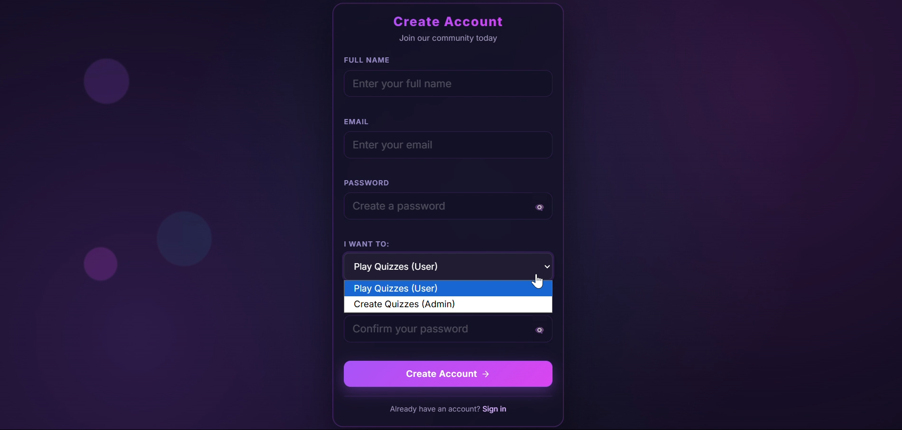
* **Login Gateway:** 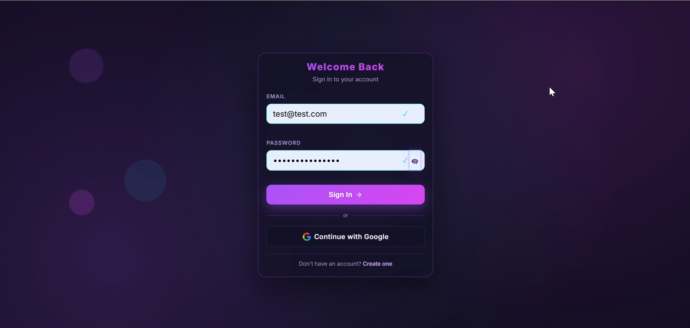

### 🎓 2. The Educator / Admin Experience
Tools engineered for rapid content creation and platform management.
* **Admin Navigation Interface:** 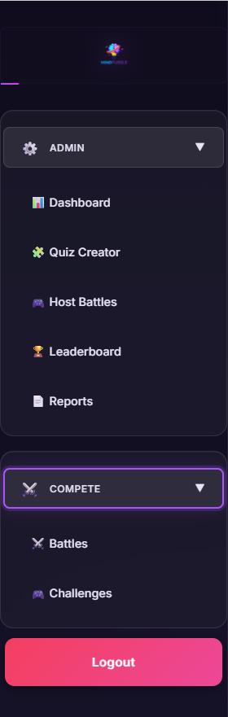
* **Quiz Creator Suite:** The terminal where educators structure and manage assessments.
  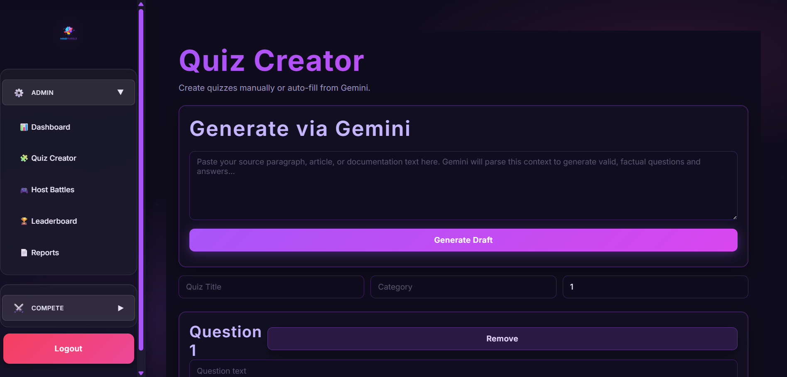


### 🎮 3. The Student / User Experience
A hyper-focused environment for gamified learning and performance tracking.
* **User Navigation Interface:** 
* **Granular Diagnostic Reports:** Post-assessment knowledge gap analysis.
  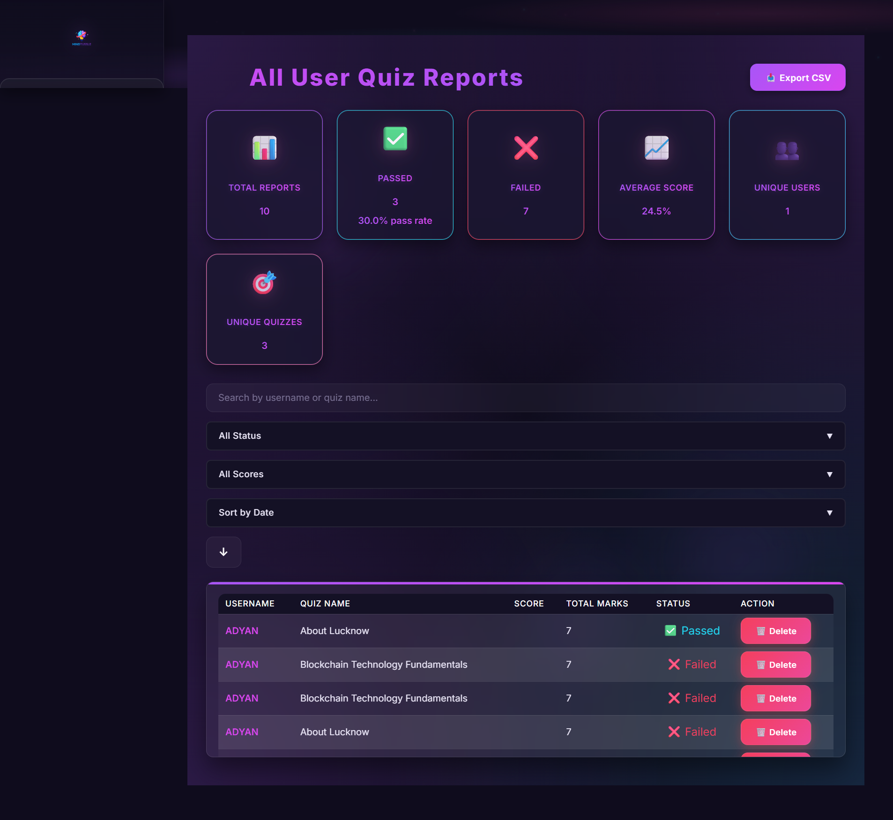
* **Milestones & Badges:** Event-driven programmatic achievements.
  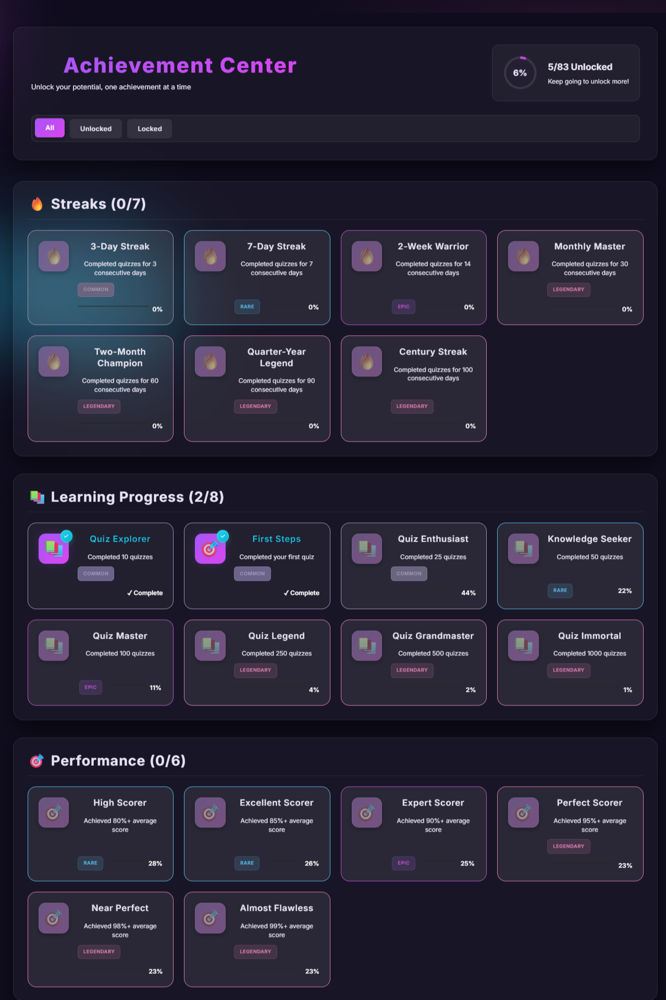
* **Global Activity Feed:** Real-time logging of platform events.
  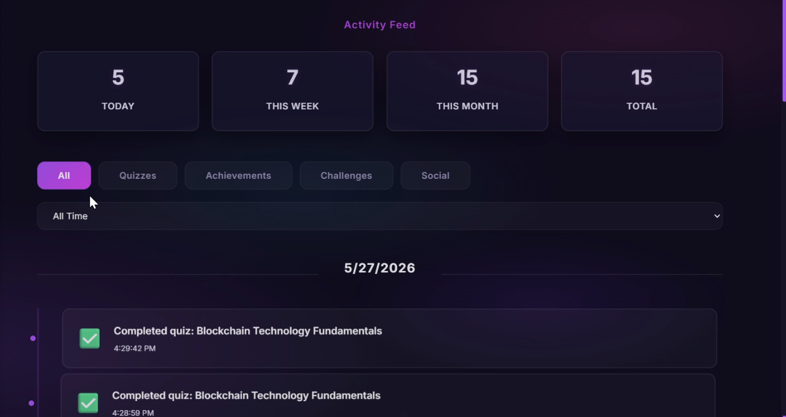

  
### ⚔️ 4. Real-Time Competitive Architecture (Socket.io)
Multiplayer battle rooms powered by persistent, bi-directional WebSockets to ensure sub-10ms event transmission latency—providing a massive performance advantage and eliminating the overhead of legacy HTTP polling.
* **Battle Mode Initialization:** 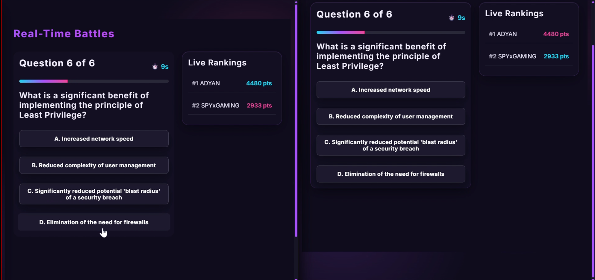
* **Lobby & Match Start:** Synchronized server-authoritative lobbies.
  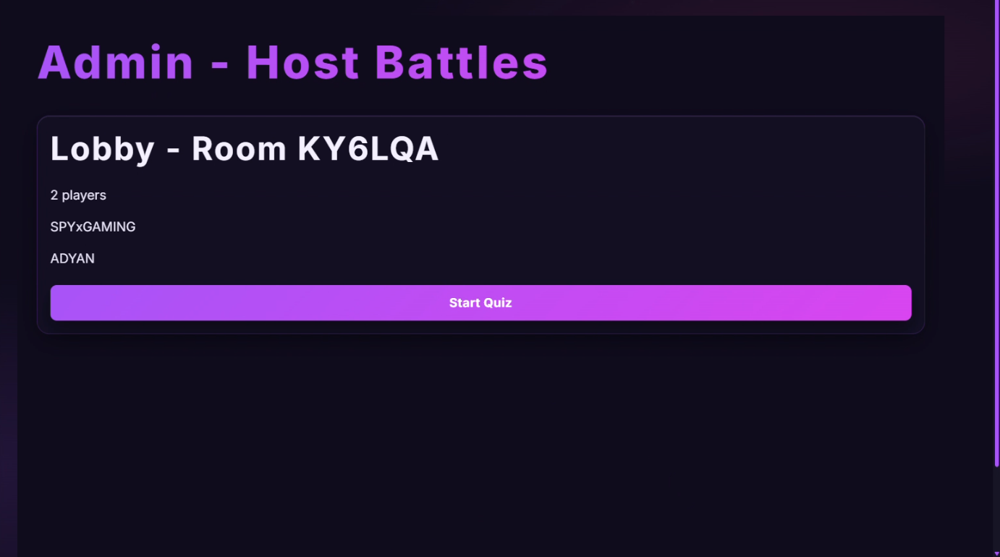
* **Live Quiz Arena:** 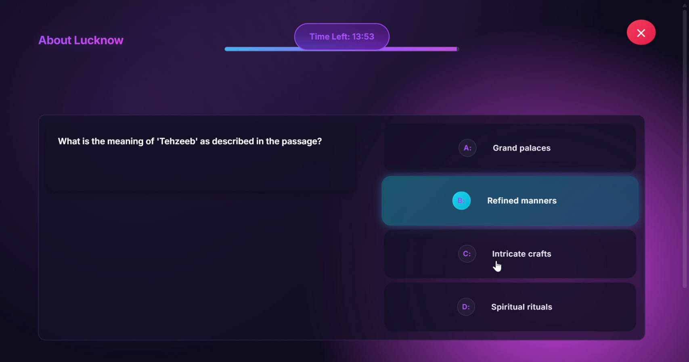
* **Match Termination & Recalculation:** 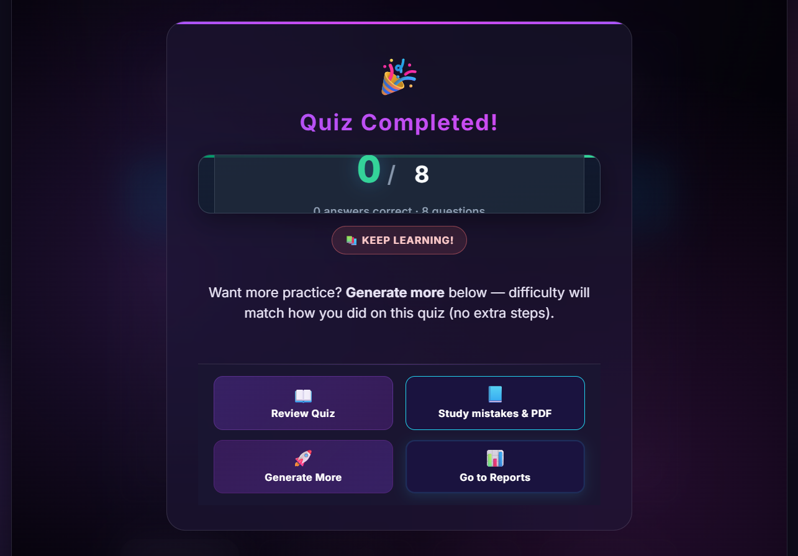
* **Historical Battle Logs:** 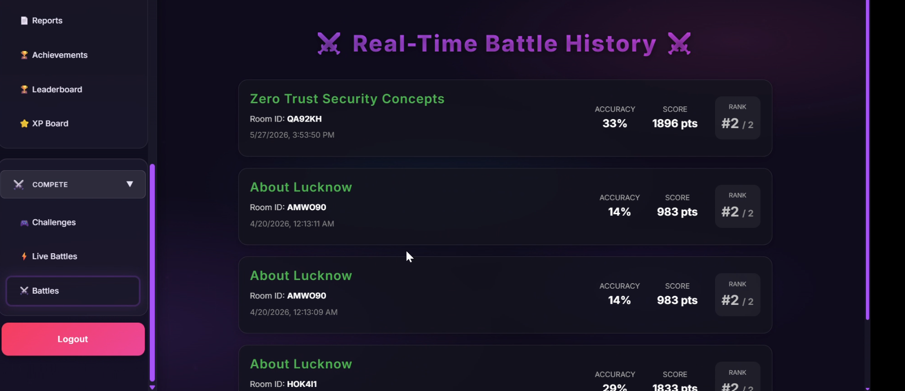

### 🏆 5. Gamification & Merit Systems
Mathematical scaling formulas calculating ranks and leaderboards.
* **Global Competitive Leaderboard:** 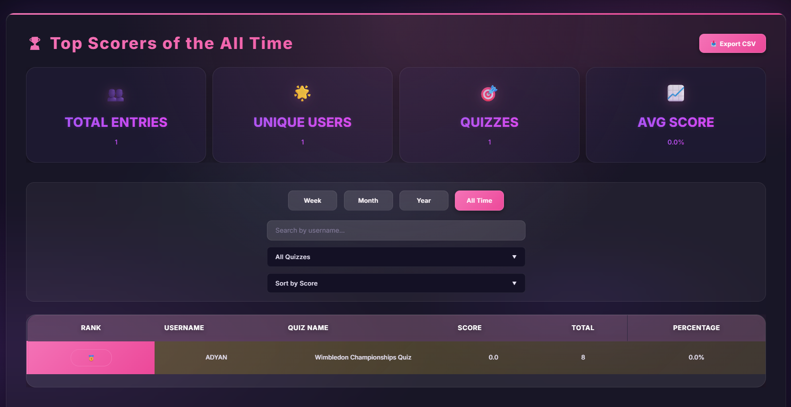
* **Experience Point (XP) Rankings:** 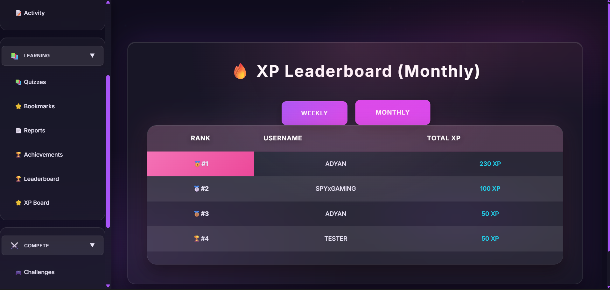

---

## Features

### Authentication & Security
- JWT-based authentication for API and socket sessions.
- Role-based access control (RBAC) with role selection at signup (`user` or `admin`).
- Protected routes for authenticated areas and role-gated admin screens.
- Security middleware with `helmet`, `express-rate-limit`, and `express-mongo-sanitize`.
- Session support for OAuth flows with secure cookie settings in production.

### Quiz Experience
- Timed quiz attempts with structured scoring and report generation.
- Dedicated flows for objective quizzes and written tests.
- Fullscreen-aware quiz interaction with guarded submit behavior.
- Bookmarking and review-oriented user flows for continuous practice.

### Real-time Multiplayer Battles
- Socket.io room system for creating and joining live quiz battles.
- Synchronized question broadcast, per-question result reveal, and live leaderboard updates.
- Guarded room transitions using `isTransitioning`, `pendingAdvanceTimer`, and controlled question advancement.
- Duplicate-answer prevention at server level (one answer per user per question).
- End-of-match XP updates and battle activity tracking.

### AI Quiz Creation
- Gemini-powered quiz generation endpoint for admin quiz authoring.
- Prompt-driven passage-to-question flow aligned with quiz schema.
- Model utility script available to validate Gemini model availability.

### Dashboard & Analytics
- User-facing analytics routes for question stats, score trends, and topic heatmaps.
- Learning analytics endpoints under the intelligence layer.
- Dashboard modules for streaks, XP progress, activity, and performance visibility.

### Admin Features
- Admin dashboard and authoring routes for quiz/test creation and management.
- Admin reporting routes for quiz and written-test result monitoring.
- Role-aware navigation and panel access based on authenticated user role.

---

## Tech Stack

| Layer | Technologies |
|---|---|
| Frontend | React 19, Vite 6, React Router, Axios, Chart.js, Framer Motion |
| Backend | Node.js, Express 4, JWT, Passport, Express Session |
| Realtime | Socket.io (server + client) |
| Database | MongoDB, Mongoose |
| AI | Google Generative AI (Gemini) |
| Testing | Vitest (frontend), Jest + Supertest (backend) |

---

## System Architecture

- **Frontend (React + Vite):** Single-page application with protected routes, admin/user modules, quiz interfaces, and analytics screens.
- **Backend (Express):** REST APIs for auth, quiz operations, reports, analytics, social modules, and admin operations.
- **Realtime Layer (Socket.io):** Live room lifecycle handling for battle creation, joins, synchronized questions, scoring, and final leaderboards.
- **Database (MongoDB + Mongoose):** Persistent storage for users, quizzes, reports, analytics, and activity data.
- **AI Layer (Gemini):** Server-side quiz generation path used in admin authoring workflows.

---

## Project Structure

```text
mind-tussle-project/
├── backend/
│   ├── controllers/
│   ├── middleware/
│   ├── models/
│   ├── routes/
│   ├── scripts/
│   ├── services/
│   ├── utils/
│   └── server.js
├── frontend/
│   ├── public/
│   ├── src/
│   │   ├── components/
│   │   ├── context/
│   │   ├── hooks/
│   │   ├── pages/
│   │   └── utils/
│   └── vite.config.js
├── package.json
└── README.md
```

## Getting Started

### Prerequisites
- Node.js 18+ (Node.js 20+ recommended)
- npm 9+
- MongoDB instance (local or hosted)

### Installation

```bash
git clone https://github.com/adyan-git/mind-tussle-project.git
cd mind-tussle-project

cd backend && npm install
cd ../frontend && npm install
```

### Environment variables

Create `backend/.env`:

```env
PORT=5000
MONGO_URI=mongodb://127.0.0.1:27017/mindtussle
JWT_SECRET=replace_with_a_long_random_string
GOOGLE_SECRET=replace_with_session_secret
FRONTEND_URL=http://localhost:5173

# Optional (AI quiz creation)
GEMINI_API_KEY=

# Optional (Google OAuth)
GOOGLE_CLIENT_ID=
GOOGLE_CLIENT_SECRET=
GOOGLE_CALLBACK_URL=http://localhost:5000/api/auth/google/callback
```

For frontend production deployments, configure:

```env
VITE_BACKEND_URL=https://your-api-domain.com
```

### Run locally

Backend:
```bash
cd backend
npm run dev
```

Frontend:
```bash
cd frontend
npm run dev
```

Local URLs:
- Frontend: `http://localhost:5173`
- Backend health check: `http://localhost:5000/ping`

## Environment Variables

| Variable | Required | Purpose |
|---|---|---|
| `MONGO_URI` | Yes | MongoDB connection string |
| `JWT_SECRET` | Yes | JWT signing secret |
| `GOOGLE_SECRET` | Yes | Session secret for OAuth/session handling |
| `FRONTEND_URL` | Yes (prod) | Allowed frontend origin for CORS/cookies |
| `PORT` | No | Backend port (`5000` default) |
| `NODE_ENV` | No | Runtime mode (`production` enables production guards) |
| `TRUST_PROXY_COUNT` | No | Proxy depth used in production deployments |
| `RENDER` | No | Hosting hint used in server config |
| `GEMINI_API_KEY` | Optional | Gemini quiz generation |
| `GOOGLE_CLIENT_ID` | Optional | Google OAuth |
| `GOOGLE_CLIENT_SECRET` | Optional | Google OAuth |
| `GOOGLE_CALLBACK_URL` | Optional | Google OAuth callback URL |
| `VITE_BACKEND_URL` | Yes (frontend prod) | Frontend API base URL |

## Scripts

### Frontend (`frontend/`)

| Command | Description |
|---|---|
| `npm run dev` | Start Vite dev server |
| `npm run build` | Build production bundle |
| `npm run preview` | Preview production build locally |
| `npm run lint` | Run ESLint |
| `npm run test` | Run Vitest suite |
| `npm run test:watch` | Run Vitest in watch mode |
| `npm run test:ci` | CI-friendly frontend test run |

### Backend (`backend/`)

| Command | Description |
|---|---|
| `npm run dev` | Start API with nodemon |
| `npm start` | Start API in production mode |
| `npm run lint` | Run ESLint |
| `npm test` | Run Jest tests |
| `npm run test:watch` | Run Jest in watch mode |
| `npm run test:coverage` | Run Jest with coverage |
| `npm run seed` | Seed backend data |
| `npm run check-models` | Check Gemini model availability |
| `npm run db:index` | Initialize/ensure MongoDB indexes |

## Security & Reliability

- JWT authentication secures API requests and realtime socket handshakes.
- RBAC enforces user/admin boundaries across backend routes and frontend panels.
- Rate limiting protects auth and API traffic under production settings.
- Input sanitization and validation reduce NoSQL injection and malformed payload risk.
- Socket room synchronization ensures consistent question state for all players.
- Duplicate answer prevention blocks second submissions for the same user/question.
- Guarded transitions prevent race conditions during question advancement.
- Standardized API error handling improves predictability in failure paths.

## Deployment

1. Set production environment variables (`NODE_ENV`, `MONGO_URI`, `JWT_SECRET`, `FRONTEND_URL`, optional OAuth/Gemini vars).
2. Build frontend:
   ```bash
   cd frontend && npm run build
   ```
3. Initialize database indexes:
   ```bash
   cd backend && npm run db:index
   ```
4. Start backend:
   ```bash
   cd backend && npm start
   ```
5. Serve `frontend/dist` via your static host/CDN and point it to the backend URL via `VITE_BACKEND_URL`.

## Future Improvements

- Add dedicated websocket metrics and alerting dashboards.
- Expand automated integration tests for multiplayer battle flows.
- Add richer export/report options for admins and instructors.
- Introduce horizontal socket scaling strategy for higher concurrency workloads.

